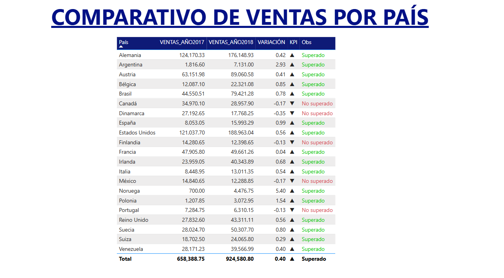

# Dashboard de Ventas de Northwind con Power Bi

## Introducción

Este dashboard interactivo ha sido desarrollado en Power BI para analizar el rendimiento de ventas de la empresa Northwind, una compañía especializada en la distribución de alimentos y bebidas a nivel internacional.

Proporciona una visión analítica de las principales métricas de ventas, permitiendo evaluar el desempeño del negocio a través de múltiples dimensiones. Entre los análisis clave, se incluyen:

- Precio por Categoría: Muestra la variación de precios entre diferentes tipos de productos, como bebidas, carnes, lácteos y más.
- Cantidad por Región y País: Permite identificar los mercados con mayor volumen de ventas y su distribución geográfica.
- Cantidad por Envío: Analiza los tipos de envío utilizados y su impacto en la logística y costos.
- Productos Discontinuados: Proporciona información sobre la cantidad de productos que han sido descontinuados y su proporción respecto al total.
- Métricas Clave: Incluye indicadores como el monto total de ventas, unidades vendidas y costos de transporte.

El dashboard cuenta con filtros interactivos para segmentar los datos por año, mes y tipo de envío, lo que permite realizar un análisis detallado y personalizado. Gracias a esta herramienta, los usuarios pueden identificar tendencias, optimizar estrategias de venta y mejorar la toma de decisiones en la empresa Northwind.

## Éxito de Ventas por País

Este gráfico de dispersión permite visualizar el rendimiento de ventas de Northwind en distintos países. Se presentan dos ejes clave:

- Eje X (Total de Ventas): Representa el volumen total de ventas en cada país.
- Eje Y (Cantidad de Ventas): Indica el número de transacciones realizadas en cada país.

A través de esta visualización, es posible identificar qué países tienen un alto volumen de ventas y cuáles han logrado una mayor cantidad de transacciones. Por ejemplo, Estados Unidos y Alemania destacan como los mercados más exitosos, mientras que otros países tienen un menor desempeño.

Este análisis ayuda a detectar mercados estratégicos, evaluar el impacto de las ventas en diferentes regiones y tomar decisiones basadas en el comportamiento de cada país.

## Comparativo de Ventas por País

Esta tabla compara el desempeño de ventas en distintos países entre los años 2017 y 2018, mostrando indicadores clave como:

- Ventas en 2017 y 2018: Presenta el monto total de ventas en cada año.
- Variación: Mide el crecimiento o decrecimiento de ventas entre ambos años.
- KPI: Indica si la meta de ventas ha sido superada o no, con símbolos visuales para facilitar la interpretación.
- Observaciones: Proporciona un estado detallado del rendimiento en cada país.

El total de ventas ha aumentado de 658,388.75 en 2017 a 924,580.80 en 2018, lo que representa un crecimiento significativo. Sin embargo, algunos países como México, Finlandia y Noruega no lograron superar sus ventas anteriores, lo que indica posibles áreas de mejora en la estrategia de ventas de la empresa.

Este análisis comparativo permite evaluar el éxito de las estrategias comerciales en cada país y tomar decisiones informadas para optimizar el rendimiento en mercados clave.
